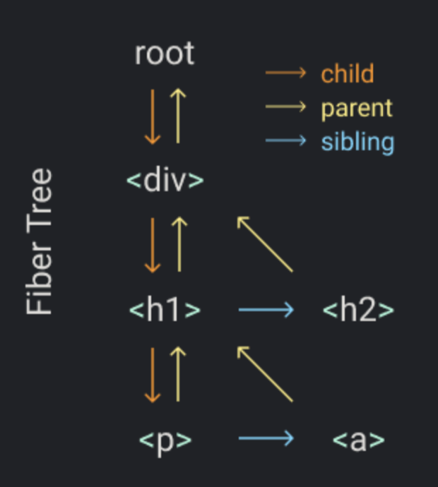

# Fibers

one fiber for each element and each fiber will be a unit of work.

render an element tree like :

```javascript
Keact.render(
    <div>
        <h1>
          <p /> 
          <a />  
        </h1>
        <h2 />
    </div>,
    container
)
```



In the **render**, we will create the root fiber and set it as the nextUnitOfWork.
The rest of the work will happen on the **performUnitOfWork** function, there we will do three things for each fiber.
1. add the element to the DOM
2. create the fibers for the element's children
3. select the next unit of work


one of the goals of this data structure is to make it easy to find the next unit of work. That's why each fiber has a link to its first child, its next sibling and its parent.
When we finish performing work on a fiber, if it has a **child** that fiber will be the next unit of work.
From our example, when we finish working on the **div** fiber the next unit of work will be the **h1** fiber.

If the fiber doesn't have a child, we use the **sibling** as the next unit of work.
For example, the **p** fiber doesn't have a **child** so we move to the **a** fiber after finishing it.

And if the fiber doesn't have a **child** nor a **sibling**, we go to the "uncle": the **sibling** of the **parent**.
Like **a** and **h2** fibers from the example.

Also, if the **parent** doesn't have a **sibling**, we keep going up through the **parents** until we find one with **sibling** or until we reach the root.If we have reached the root, it means we have finished performing all the work for this **render**.

